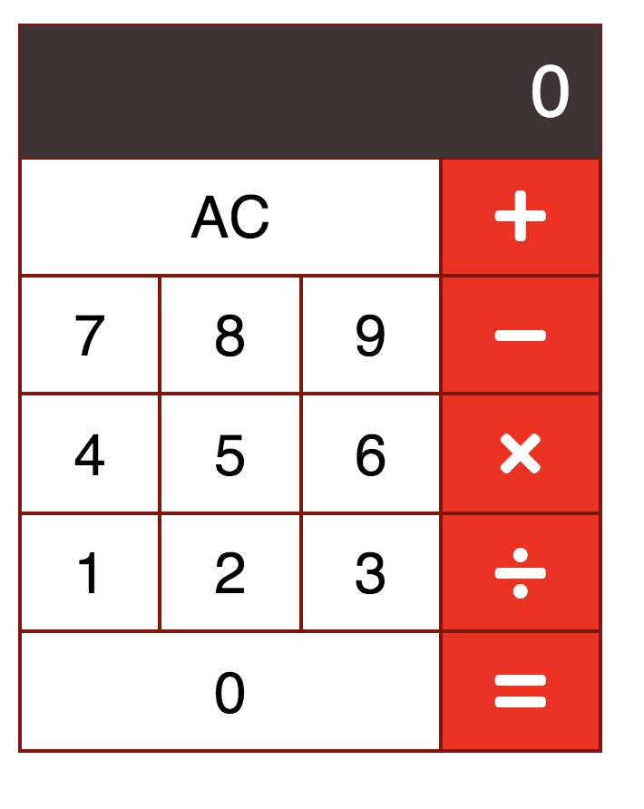

# Calculator Project
This is a calculator web app, built with ReactJS.

# App Screenshot

# Installation Instructions
- clone my repo https://github.com/mavisluan/calculator.git
- install all project dependencies with yarn install
- start the development server with yarn start
